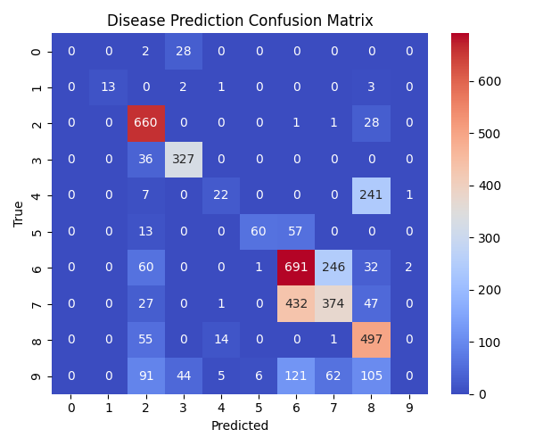

🧬 GeneGuard — AI Genomic Disease Risk Predictor

AI-powered genomic risk assessment system that predicts disease susceptibility and genetic risk factors using DNA sequence, clinical, and lifestyle data.

🧠 Overview

GeneGuard is an intelligent bioinformatics system designed to analyze genomic, clinical, and lifestyle features to predict hereditary or lifestyle-linked diseases such as diabetes, cardiac disorders, cancer, and obesity.

It integrates machine learning (RandomForest, CatBoost) and deep neural networks (Keras/TensorFlow) for high-accuracy prediction and explainability using SHAP/LIME.

🎯 Objectives

Predict disease likelihood from genomic, clinical, and behavioral data

Identify top contributing genes and risk factors

Enable personalized, preventive healthcare analytics

Provide interpretable, visualized outputs for each patient/sample

⚙️ Project Workflow
1️⃣ Data Ingestion
Source	Examples
Genomic Data	Gene expression / SNP / mutation CSVs
Clinical Data	Age, BMI, cholesterol, blood pressure
Lifestyle Data	Smoking, diet, exercise frequency
Label	Presence or absence of disease

Your dataset files are stored at:

C:\Users\NXTWAVE\Downloads\Genomic Disease Risk Predictor\archive\
│
├── train.csv
├── test.csv
└── sample_submission.csv

2️⃣ Feature Engineering
Type	Examples
Genetic	SNP markers, gene expression levels
Clinical	BMI, age, vitals
Lifestyle	Sleep hours, physical activity
Derived	PCA features, z-scores, interactions
3️⃣ Model Training (geneguard_pipeline.py)

This script:

Preprocesses and scales features

Trains:

🌲 RandomForest (tabular feature learner)

🧠 Deep Neural Network (learns nonlinear gene-disease patterns)

Saves artifacts:

geneguard_model.pkl (RandomForest)

geneguard_model.h5 (DNN)

geneguard_metadata.yaml (pipeline summary)

Visualization images & JSON outputs

Command:

python geneguard_pipeline.py

Artifacts generated:

outputs/
├── geneguard_model.pkl
├── geneguard_model.h5
├── gene_importance.png
├── disease_risk_heatmap.png
├── prediction_results.json
└── geneguard_metadata.yaml

4️⃣ Visualization (visualize_findings.py)

Generates analytical plots:

Graph	Description
accuracy_graph.png	RF vs DNN model accuracy comparison
confusion_heatmap.png	True vs predicted disease classes
feature_concentration_graph.png	Feature importance distribution
prediction_graph.png	Prediction confidence per sample

Command:

python visualize_findings.py

Output:

outputs/
├── accuracy_graph.png
├── confusion_heatmap.png
├── feature_concentration_graph.png
├── prediction_graph.png
└── visualization_summary.json

5️⃣ Prediction & Disease Labeling (predict_disease_results.py)

This script loads the trained models, applies them on the test.csv, and predicts actual disease types for each individual.

Output File	Description
disease_predictions.csv	Per-sample disease predictions with confidence
disease_predictions.json	JSON version for API / dashboard use

Command:

python predict_disease_results.py

Example Output:

Sample_ID	RF_Prediction	DNN_Prediction	Final_Predicted_Disease	Confidence
1	Diabetes	Diabetes	Diabetes	0.94
2	Cardiac Disorder	Cancer	Cardiac Disorder	0.82
3	Cancer	Cancer	Cancer	0.91
🧩 Directory Structure
GeneGuard/
│
├── archive/
│   ├── train.csv
│   ├── test.csv
│   └── sample_submission.csv
│
├── outputs/
│   ├── geneguard_model.pkl
│   ├── geneguard_model.h5
│   ├── gene_importance.png
│   ├── disease_risk_heatmap.png
│   ├── accuracy_graph.png
│   ├── confusion_heatmap.png
│   ├── feature_concentration_graph.png
│   ├── prediction_graph.png
│   ├── prediction_results.json
│   ├── geneguard_metadata.yaml
│   ├── disease_predictions.csv
│   └── disease_predictions.json
│
└── scripts/
    ├── geneguard_pipeline.py
    ├── visualize_findings.py
    └── predict_disease_results.py

🧰 Tech Stack
Layer	Tools Used
Data Science	Pandas, NumPy, Scikit-learn
Deep Learning	TensorFlow / Keras
Visualization	Matplotlib, Seaborn, Plotly
Explainability	SHAP, LIME
Bioinformatics	Biopython, SciPy
Storage	YAML, JSON, Pickle, H5
📊 Key Visuals

gene_importance.png — Top 20 predictive genes/features

disease_risk_heatmap.png — Risk intensity per patient

accuracy_graph.png — Model accuracy comparison

prediction_graph.png — Sample-wise confidence trends

🧬 Disease Mapping

Default label-to-disease mapping (predict_disease_results.py):

ID	Disease
0	Diabetes
1	Cardiac Disorder
2	Cancer
3	Obesity
4	Hypertension
5	Neurological Disorder
6	Liver Disease
7	Kidney Disorder
8	Respiratory Disease
9	No Disease Detected

🔧 You can modify this mapping as per your dataset’s class definitions.

📦 Installation
pip install pandas numpy scikit-learn tensorflow seaborn matplotlib pyyaml joblib

🚀 How to Run
# Step 1: Train Models
python geneguard_pipeline.py

# Step 2: Visualize Results
python visualize_findings.py

# Step 3: Predict Disease Types
python predict_disease_results.py

All results will appear inside the outputs/ folder.

🔍 Example Use Cases
Sector	Application
🧬 Genomics Research	Identify genetic factors driving disease
🏥 Healthcare AI	Personalized treatment recommendations
🧫 Pharma R&D	Drug response prediction
🧍 Personalized Wellness	Preventive lifestyle suggestions
💡 Future Enhancements

Integrate full genome (FASTA/VCF) data parsing

Add AutoML (Optuna/TPOT) for model tuning

Deploy as an API / Streamlit dashboard for clinics

Explainable AI layer with SHAP visualizations

Real-time data ingestion from hospital systems

👨‍🔬 Author

Sagnik Patra
M.Tech in Computer Science & Engineering, IIIT
GitHub: sagnik1-patra

Project: GeneGuard — AI Genomic Disease Risk Predictor
